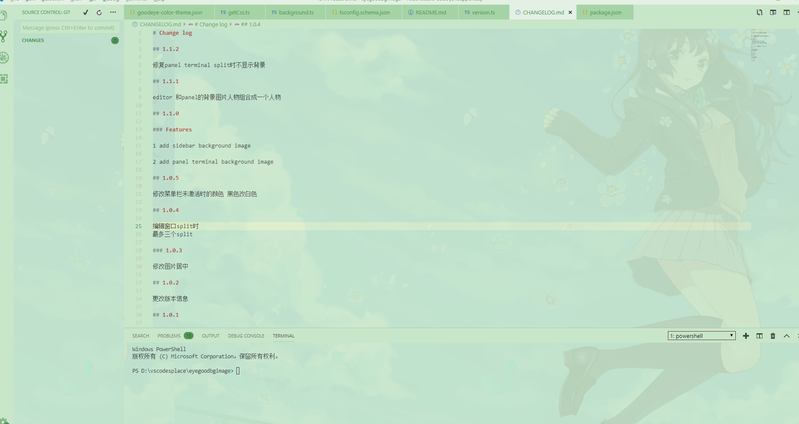

# eye good and background image

护眼模式

## Config 配置项

| Name                      |      Type       | Description                                                                                 |
| :------------------------ | :-------------: | :------------------------------------------------------------------------------------------ |
| `background.enabled`      |    `Boolean`    | 插件是否启用   If background enabled.                                                    |
| `background.useDefault`   |    `Boolean`    | 是否使用默认图片   If use default images.                                                |
| `background.customImages` | `Array<String>` | 自定义图片，最多 3 个，<em>现在三个背景依次时editor panel sidebar的背景图片</em>  Your Your custom Images(Max length is 3)                          |
| `background.style`        |    `Object`     | 自定义样式   Custom style                                                                |
| `background.styles`       | `Array<Object>` | 每个图片的独立样式   Style of each image.                                                |
| `background.useFront`     |    `Boolean`    | 前景图/背景图。 在代码上面还是下面   `true`:On the top of code. `false`: Behind the code |

sidebar和panel 暂时不能配置

## Notice 提示

**http** 协议的外链图片在当前版本不能使用(vscode 限制)，需要用 **https** 协议开头的外链地址。

You should use protocol **https** instead of **http** to the image,which is not support by vscode now.

## Uninstall 卸载

   1 Set the config  {"background.enabled": false}  in settings.json,then uninstall the plugin.
    在 settings.json 中设置 {"background.enabled": false} ，然后再删除插件。如果直接删除插件会有遗留，就需要重装vscode了。
   2 如果还是删除不掉背景图片，就到项目安装目录下找到Microsoft VS Code\resources\app\out\vs\workbench\workbench.main.css 文件
   把下面这些删掉
  /*css-background-start*/
  /*background.ver.1.0.1*/
  [id="workbench.parts.editor"] 太长省略一大片

  [id="workbench.parts.editor"] .split-view-view .editor-container  .overflow-guard>.monaco-scrollable-element>.monaco-editor-background{background: none;}

  省略一些 到下面一行结束
  /*css-background-end*/

---

### 开发

npm install

vsce craate-publisher eyegoodbgimage

vsce publish

vsce publish patch

如果上面两个不能部署，则手动部署
vsce package
用插件项目管理上传生成的eyegoodbgimage-x.y.z.vsix文件
